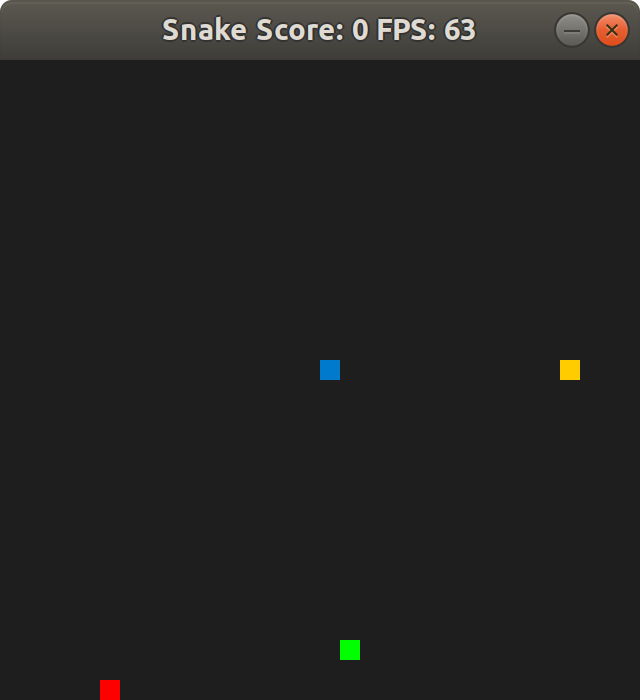

# CPPND: Capstone Snake Game Example

This is a extended repo for the Capstone project in the [Udacity C++ Nanodegree Program](https://www.udacity.com/course/c-plus-plus-nanodegree--nd213). The code for this repo was inspired by [this](https://codereview.stackexchange.com/questions/212296/snake-game-in-c-with-sdl) excellent StackOverflow post and set of responses.

The Capstone Project gives you a chance to integrate what you've learned throughout this program. This project will become an important part of your portfolio to share with current and future colleagues and employers.

In this project, you can build your own C++ application or extend this Snake game, following the principles you have learned throughout this Nanodegree Program. This project will demonstrate that you can independently create applications using a wide range of C++ features.

## Overview and Instructions

The Capstone Project extends the Snake game:
1) It gives the chance to player to score more points my eating the green block before the yellow it gives 3 extra points.

2) If the yellow block is eaten before the green one there are no extra points.

3) It increases the risk where if the snake eats the red block it dies.

## Code Structure 

<imd src="tree_snake.png">

## Rubrics
### Loops, Functions, I/O
1) The project demonstrates an understanding of C++ functions and control structures.
  a) Controller.cpp line 14 "while loop"
  b) Game.cpp line 24, line 59, line 74, line 88,  "while loop"
  c) snake.cpp line 73 "for loop"
  d) functions in file snake.cpp, controller.cpp, game.cpp

2) The project accepts user input and processes the input.
  a) controller.cpp line 14 it read the input for moving the snake around.

### Object Oriented Programming
3) The project uses Object Oriented Programming techniques.
  a) There are classes defined in file snake.cpp, controller.cpp, game.cpp and renderer.cpp

4) Classes use appropriate access specifiers for class members.
  a) There are private and public members in the file snake.cpp, controller.cpp, game.cpp and renderer.cpp

5) Class constructors utilize member initialization lists.
  a) The initialization of Game class in file game.cpp at line 5, of Renderer class in file renderer.cpp at line 5 and of Snake class in file snake.h at line 11.

### Memory Management

6) The project makes use of references in function declarations.
  a) In file snake.cpp line 33 it take references and in file game.h line 13 it take references.
  

## Dependencies for Running Locally
* cmake >= 3.7
  * All OSes: [click here for installation instructions](https://cmake.org/install/)
* make >= 4.1 (Linux, Mac), 3.81 (Windows)
  * Linux: make is installed by default on most Linux distros
  * Mac: [install Xcode command line tools to get make](https://developer.apple.com/xcode/features/)
  * Windows: [Click here for installation instructions](http://gnuwin32.sourceforge.net/packages/make.htm)
* SDL2 >= 2.0
  * All installation instructions can be found [here](https://wiki.libsdl.org/Installation)
  >Note that for Linux, an `apt` or `apt-get` installation is preferred to building from source. 
* gcc/g++ >= 5.4
  * Linux: gcc / g++ is installed by default on most Linux distros
  * Mac: same deal as make - [install Xcode command line tools](https://developer.apple.com/xcode/features/)
  * Windows: recommend using [MinGW](http://www.mingw.org/)

## Basic Build Instructions

1. Clone this repo.
2. Make a build directory in the top level directory: `mkdir build && cd build`
3. Compile: `cmake .. && make`
4. Run it: `./SnakeGame`.

## CC Attribution-ShareAlike 4.0 International

Shield: [![CC BY-SA 4.0][cc-by-sa-shield]][cc-by-sa]

This work is licensed under a
[Creative Commons Attribution-ShareAlike 4.0 International License][cc-by-sa].

[![CC BY-SA 4.0][cc-by-sa-image]][cc-by-sa]

[cc-by-sa]: http://creativecommons.org/licenses/by-sa/4.0/
[cc-by-sa-image]: https://licensebuttons.net/l/by-sa/4.0/88x31.png
[cc-by-sa-shield]: https://img.shields.io/badge/License-CC%20BY--SA%204.0-lightgrey.svg
